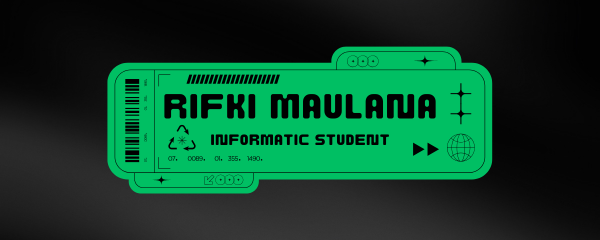

## Welcome to My Github Profile! 👋

<!--
**rifkimlna/rifkimlna** is a ✨ _special_ ✨ repository because its `README.md` (this file) appears on your GitHub profile.

Here are some ideas to get you started:

- 🔭 I’m currently working on ...
- 🌱 I’m currently learning ...
- 👯 I’m looking to collaborate on ...
- 🤔 I’m looking for help with ...
- 💬 Ask me about ...
- 📫 How to reach me: ...
- 😄 Pronouns: ...
- ⚡ Fun fact: ...
-->

## 👋 Welcome to My GitHub Profile!

Hi! I'm **Rifki Maulana**, an **Informatics Engineering student** with a strong interest in **full-stack web development**, particularly in the **backend**. I'm passionate about building software solutions and learning modern web technologies.

---

### 💡 About Me
- 🎓️ Informatics Engineering student
- 🌐️ Passionate about **Web Development**, **Software Engineering**, and **Backend Technologies**
- 💻️ Familiar with: `HTML`, `CSS`, `PHP`, `MySQL`
- 📦️ Currently learning: `MongoDB`, `Node.js`
- 🛠️ Tools I use: `MySQL Workbench`, `Git`, `XAMPP`, `Visual Studio Code`, `Php Storm`
- 🚀 Always excited to explore new technologies and collaborate on real-world projects!

### 🧰 Tech Stack

#### 🔤 Languages & Libraries

  
  
  
  
  
  

#### 💾 Databases & Backend

  
  

#### 🛠️ Tools

  
  
  
  
  
  

---

---

### 📫 Let's Connect!
- 🔗 [LinkedIn](https://www.linkedin.com/in/rifkimaualanaa)
- 📧 rifkimaulana23@ummi.ac.id
- 🌐 https://portofolio-alpha-amber.vercel.app/

---

> _"Are you a one or a zero."_